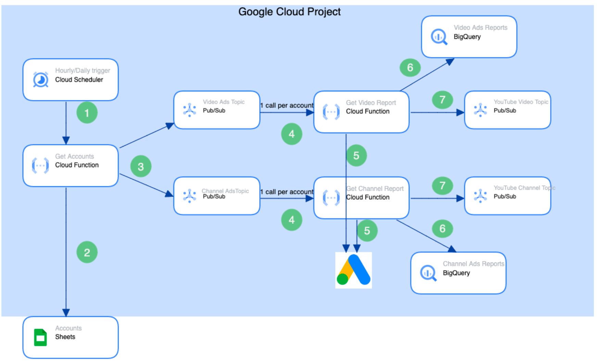
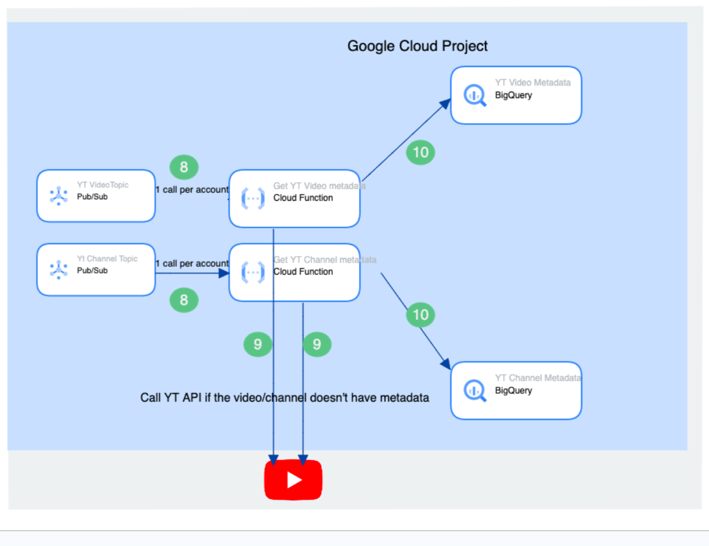

# YouTube Ads Toolbox Architecture

## Google Cloud Architecture

This is a high level view of the architecture and will most likely change as we add features to the solution.

The solution is split into six microservices:

- Google Ads Account Service
- Google Ads Video Reporting Service
- Google Ads Channel Reporting Service
- Google Ads Exclusion list Service (WIP)
- YouTube Video Service
- YouTube Channel Service

The source code for each of the Cloud Functions can be found under the `/src/`
directory of this repo.

### Google Ads Account Service

This service is responsible for deciding which Google Ads accounts the Ads
Placement Excluder solution should run for, and kicking off the downstream
pipeline. Each account is pushed as a separate message into the topic to enable
concurrency.

1. Cloud Scheduler triggers the Account Cloud Function.
2. The function pulls from the Google Sheet the Google Ads customer IDs to run the code for, and the filters to apply to the Google Ads report.
3. Each customer ID is pushed in a separate message to Pub/Sub.

### Google Ads Video Reporting Service

This service is responsible for running a report from Google Ads based on the
[detail_placement_view](
https://developers.google.com/google-ads/api/fields/v11/detail_placement_view),
with the configured filters, and outputting that as a CSV to a Cloud Storage
bucket, with a BigQuery table in front of it. The data pulled from the report is
filtered to only have YouTube videos.

1. Pub/Sub triggers the Cloud Function.
2. The report is downloaded from Google Ads.
3. The output is written as a CSV to Cloud Storage.
4. A message is passed to the next Pub/Sub topic.

Note that when running the service for the same account on the same day, the CSV file for account/day combination will simply be overwritten so you will only keep the most up-to-date data.

### Google Ads Channel Reporting Service

This service is responsible for running a report from Google Ads based on the
[group_placement_view](
https://developers.google.com/google-ads/api/fields/v11/group_placement_view),
with the configured filters, and outputting that as a CSV to a Cloud Storage
bucket, with a BigQuery table in front of it. The data pulled from the report is
filtered to only have YouTube channels.

1. Pub/Sub triggers the Cloud Function.
2. The report is downloaded from Google Ads.
3. The output is written as a CSV to Cloud Storage.
4. A message is passed to the next Pub/Sub topic.

Note that when running the service for the same account on the same day, the CSV file for account/day combination will simply be overwritten so you will only keep the most up-to-date data.

### YouTube Video Reporting Service

This service is responsible for pulling metrics and details about the YouTube videos from
the Google Ads Video Report. For example the number of views the video has had,
the number of likes, the title, description and tags, which can be used to filter the videos. Before sending the request to Youtube, we check that we've never seen the video before (it doesn't have an entry in the YouTube videos table)

1. Pub/Sub triggers the Cloud Function.
2. The function reads the new videos that were pulled from Google Ads. It does
   not refresh the data for existing videos.
3. The function pulls the YouTube data for each of the videos in step 2.
4. The output is written to a BigQuery table.

### YouTube Channel Reporting Service

This service is responsible for pulling metrics and details about the YouTube channels from
the Google Ads Channel Report. For example the number of views the channel has had,
the number of subscribers, topics, country and title. Before sending the request to Youtube, we check that we've never seen the channel before (it doesn't have an entry in the YouTube channels table)

1. Pub/Sub triggers the Cloud Function.
2. The function reads the new channels that were pulled from Google Ads. It does
   not refresh the data for existing channels.
3. The function pulls the YouTube data for each of the channels in step 2.
4. The output is written to a BigQuery table.

### Google Ads Exclusion List service

This service pulls the Exclusion List linked to your accounts to BigQuery. This can later be used to check what you‘ve already excluded and understand patterns in what you're excluding.

1. Pub/Sub triggers the Cloud Function.
1. The function pulls all active exclusions for a Google Ads account.
1. The output is written to a BigQuery table.

### Entire Solution Architecture

Combining the individual services, you can a high level architecture diagram
below (to be redrawn):

1. Cloud Scheduler triggers the Account Cloud Function.
2. The function pulls the Google Ads customer IDs to run the code for, and the filters to apply to the Google Ads report.
3. Each customer ID is pushed in a separate message to Pub/Sub.
4. Pub/Sub triggers the Cloud Function.
5. The Video report is downloaded from Google Ads.
5. The Channel report is downloaded from Google Ads.
6. The output is written as a CSV to Cloud Storage, with BigQuery in front.
7. A message is passed to the next Pub/Sub topic.
8. Pub/Sub triggers the Cloud Function.
9. The function reads the channels that were pulled from Google Ads, and pulls their metadata from YouTube.
9. The function reads the videos that were pulled from Google Ads, and pulls their metadata from YouTube.
10. The output is written to BigQuery.

## How Do I use the data
The data can be queried directly from BigQuery. We can add a view joining the Ads tables and the YouTube tables, then use a dashboarding tool like Looker Studio to analyse it and apply different filters to better understand where your ads are showing and how they are performing.

## BigQuery External Tables Using Cloud Storage

Some parts of the solution use [BigQuery External tables with a Google Cloud Storage
backend](https://cloud.google.com/bigquery/docs/external-data-cloud-storage),
instead of writing to BigQuery directly due to concurrency. BigQuery has much
stricter limits in place about concurrent writes ([docs](
https://cloud.google.com/bigquery/quotas)), so if the solution is configured
with several Google Ads accounts, it can run into difficulty when writing
directly to BigQuery.

Leveraging Cloud Storage removes this limitation, and the
BigQuery External Table provides a way of querying the data using SQL.

## Google Ads Exclusions

There are several places that exclusions can be applied in Google Ads. You can export lists as CSV and upload them manually to exclusion lists. An automation for the process will potentially be added if there is a clear use case.

## Disclaimers

__This is not an officially supported Google product.__

Copyright 2023 Google LLC. This solution, including any related sample code or
data, is made available on an “as is,” “as available,” and “with all faults”
basis, solely for illustrative purposes, and without warranty or representation
of any kind. This solution is experimental, unsupported and provided solely for
your convenience. Your use of it is subject to your agreements with Google, as
applicable, and may constitute a beta feature as defined under those agreements.
To the extent that you make any data available to Google in connection with your
use of the solution, you represent and warrant that you have all necessary and
appropriate rights, consents and permissions to permit Google to use and process
that data. By using any portion of this solution, you acknowledge, assume and
accept all risks, known and unknown, associated with its usage, including with
respect to your deployment of any portion of this solution in your systems, or
usage in connection with your business, if at all.